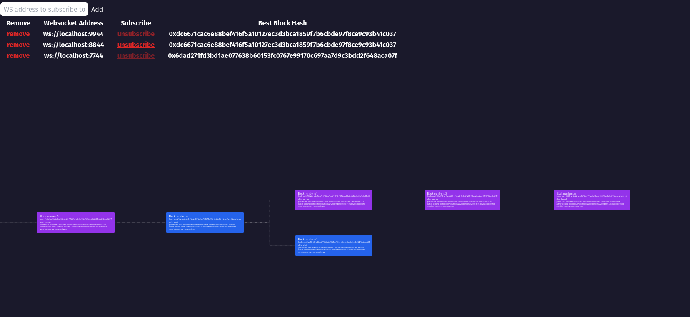

# Multi PoW Fork Visualizer

This is a webapp for visualizing the blockchain datastructure created by the multi-pow node when following the forking workshop described in the repository root.

The visualizer helps to display several unique things about this network and the forking activities performed in the workshop. Most notably, it shows:

* Which PoW algorithm sealed each block
* Blocks on all forks
* All sides of a contentious network-splitting fork.



## Docker Compose (Complete Network)

The easiest way to get this UI up and running to try it out and play around is to use the provided Docker compose file.
This will start up a multi-node network as well as this visualizer UI.

The `docker-compose.yml` includes the fork-visualizer and 1 node in the network. If you would like to include more nodes, just uncomment the blocks.
Please note the resource requirements when adding multiple nodes.

```sh
# to run and build this locally run
docker-compose up --build

# go to http://localhost:3000
```

## With an Existing Blockchain

If you already have a blockchain network running, the docker compose file is not for you.
This is likely the case if you are part of a live workshop.
Or if you want to start your own network manually, see the instructions in the repo root.

## Docker Image (Visualizer Only)

To run only the containerized visualizer UI, you can run:

```sh
# TODO We need a CI to actually publish this image first
# This will not work right now.
# It is aspirational
docker run ghcr.io/polkadot-blockchain-academy/multi-pow-visualizer
```

## Running Locally

```bash
npm install
npm run dev

Open [http://localhost:3000](http://localhost:3000) with your browser to see the visualizer.

## Usage

The short version:
* Add your node endpoints to the UI
* Watch the chain grow
* Perform some forks and see the result
